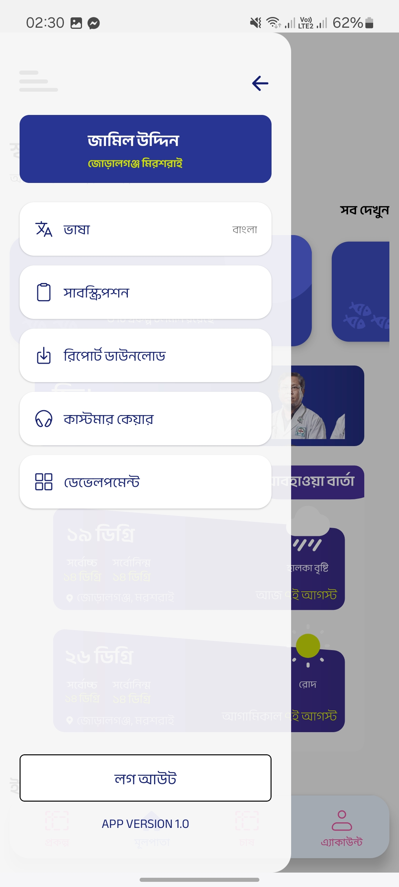
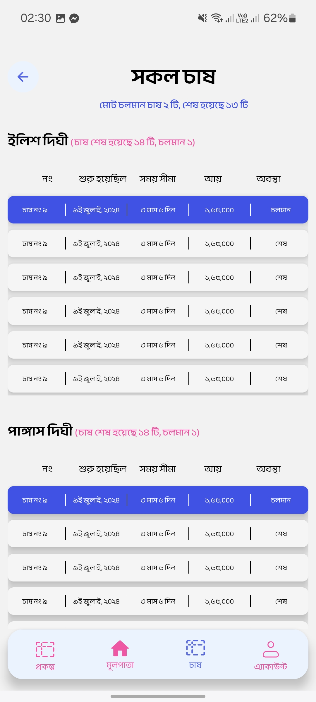
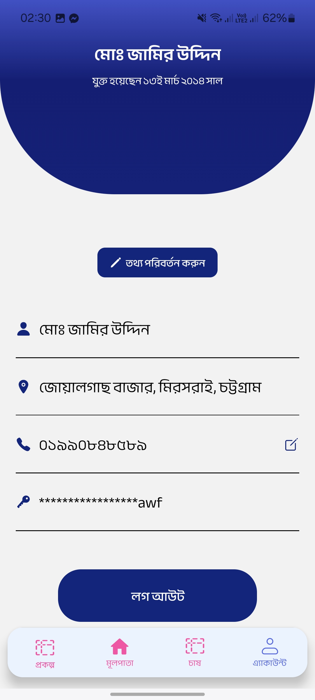
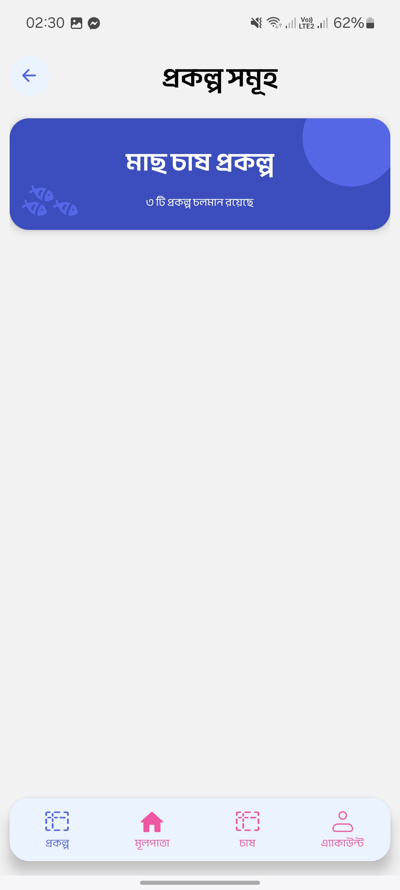
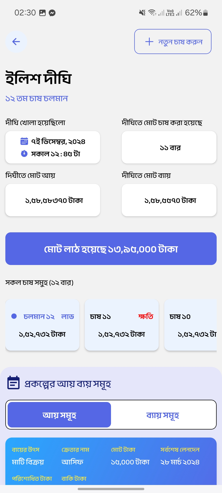
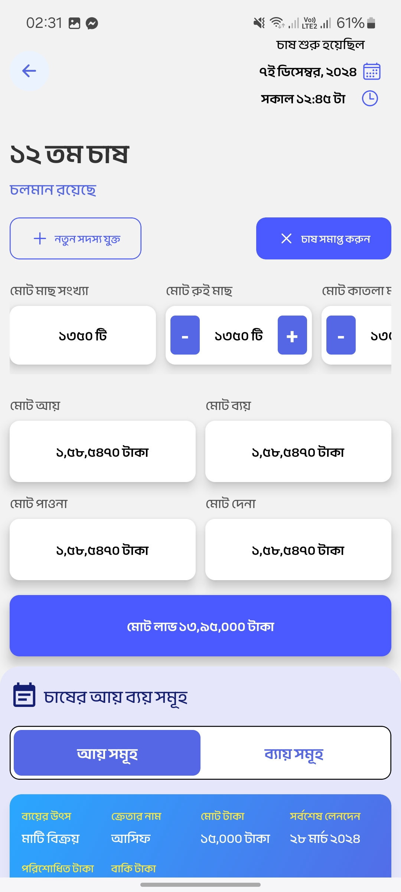

# Prani Bondhu

## Overview

**Prani Bondhu** is a mobile app built with **React Native**, designed to help fish farmers manage their aquaculture operations more efficiently. The app offers tools for real-time monitoring, task scheduling, inventory tracking, and more — all in a user-friendly interface with **Bengali** language support.

---

## Features

- **Farm Monitoring** – Track water quality, fish health, and growth metrics  
- **Task Management** – Schedule feeding, harvesting, and maintenance tasks  
- **Data Logging** – Record fish stock, feed usage, and environmental conditions  
- **Alerts & Notifications** – Receive warnings for low oxygen or pH levels  
- **Inventory Management** – Monitor feed, fish, and equipment levels  
- **User Profile** – Manage farmer details and farm information  
- **Analytics Dashboard** – Visual insights with graphs and trend data  
- **Multi-Language Support** – Bengali by default, with option to switch languages  
- **Real-Time Updates** – Stay updated on transactions and farm activity  
- **Transaction History** – View all past transactions and records  
- **Payment Options** – Send/receive payments for supplies or labor  
- **Search Functionality** – Quickly find records, tasks, or transactions  
- **Customer Support** – Report issues or access FAQs from the app  
- **Appointment Scheduling** – Book consultations or service visits  
- **Weather Updates** – View weather forecasts to plan your farm activities  
- **Fish Health Check** – Assess fish health visually or with manual input  
- **Feed Calculator** – Calculate optimal feeding quantities  
- **Photo Gallery** – Save and upload photos of farm or fish  
- **Tutorial/Guide** – In-app learning resources for beginners  
- **Settings & Preferences** – Customize notifications and language  

---

## Installation

1. Make sure you have **Node.js** and **React Native** set up  
2. Clone the repository:

   ```bash
   git clone <repository-url>
   ```

3. Navigate to the project folder:

   ```bash
   cd PraniBondhu
   ```

4. Install dependencies:

   ```bash
   npm install
   ```

5. Run the app:

   ```bash
   npx react-native run-android
   # or
   npx react-native run-ios
   ```

---

## Usage

- **Login** – Sign in with your phone number and password  
- **Dashboard** – View farm status, tasks, and analytics  
- **Monitoring** – Track real-time data and receive alerts  
- **Transactions** – Manage payments and check history  
- **Support** – Contact help or book an appointment  
- **Settings** – Update your profile and preferences  

---

## Screenshots

Screenshots of the app (from the `/attachments/` folder) are shown below:

<div style="display: flex; flex-wrap: wrap; gap: 40px;">
  
  
  
  
  
  
  
  
  
  
  
  
  
  
  
  
  
  
  
  
  
</div>


---

## Version

**Current Version**: 1.0

---

## Contributing

We welcome contributions!  
Fork this repository and submit a pull request for any bug fixes or improvements.

---

## License

This project is licensed under the **MIT License**.  
See the [LICENSE](LICENSE) file for more details.

---

## Contact

For support, please use the in-app help section or visit our official website (if available).
