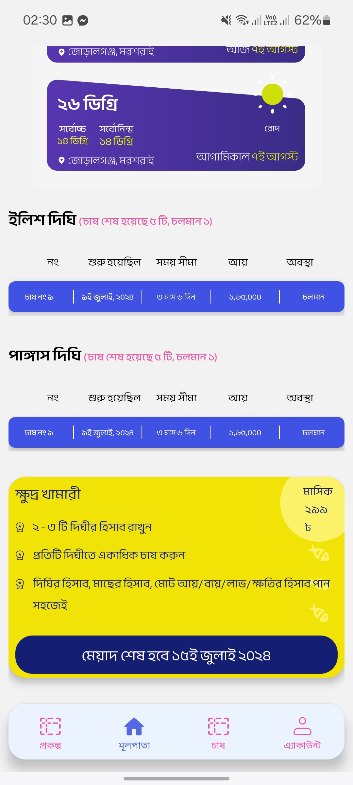
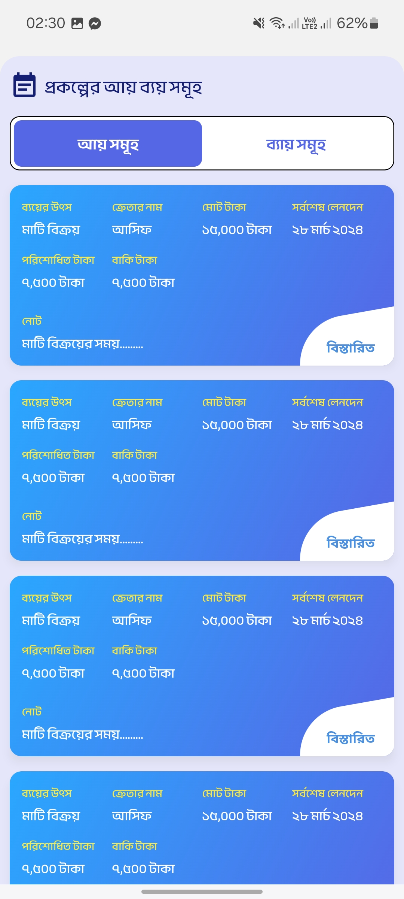
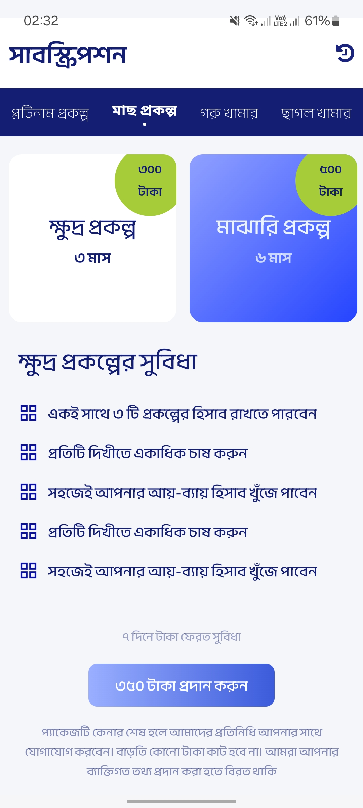

It looks like the markdown syntax isn't rendering as expected. This may be due to the way certain characters or formatting elements are used in the markdown, like **bold** or *italic*. I suggest the following steps to ensure proper rendering on GitHub:

1. Make sure your markdown syntax uses `*` for bullet points and proper headings with `##` for sections.
2. Use backticks (`` ` ``) for inline code or paths.
3. Ensure proper placement of images and tables.

Here is the fixed version of the `README.md` file for you:

````markdown
# Prani Bondhu

## Overview

**Prani Bondhu** is a mobile application developed using **React Native**, designed to assist fish farmers in managing their aquaculture activities efficiently. The app provides tools for monitoring, managing, and optimizing fish farming operations with a user-friendly interface in **Bengali**.

---

## Features

- **Farm Monitoring**: Real-time tracking of water quality, fish health, and growth metrics.  
- **Task Management**: Schedule and manage feeding, harvesting, and maintenance tasks.  
- **Data Logging**: Record and store data on fish stock, feed usage, and environmental conditions.  
- **Alerts & Notifications**: Receive alerts for critical conditions like low oxygen levels or pH imbalances.  
- **Inventory Management**: Track feed, equipment, and fish stock levels.  
- **User Profile**: Manage farmer details and farm information, including name, address, and contact.  
- **Analytics Dashboard**: View insights and trends based on collected data, including graphs and charts.  
- **Multi-Language Support**: Primarily in Bengali, with options to switch languages.  
- **Real-Time Updates**: Provides real-time balance and transaction updates for farm activities.  
- **Transaction History**: View detailed records of financial transactions related to farming.  
- **Payment Options**: Facilitate payments for feed, equipment, or labor with money send/receive features.  
- **Search Functionality**: Search for specific transactions, tasks, or farm records.  
- **Customer Support**: Access customer care options, report issues, and view FAQs.  
- **Appointment Scheduling**: Schedule appointments for consultations or support.  
- **Weather Updates**: Display weather forecasts to aid farming decisions.  
- **Fish Health Check**: Assess fish health with visual indicators or manual input options.  
- **Feed Calculator**: Calculate optimal feed amounts based on fish size and stock.  
- **Photo Gallery**: Capture, save, and upload photos of fish or farm conditions.  
- **Tutorial/Guide**: Access in-app tutorials or guides for new farmers.  
- **Settings & Preferences**: Adjust app settings, including notifications and language.  

---

## Installation

1. Ensure you have **Node.js** and the **React Native** environment set up.  
2. Clone the repository:  
   ```bash
   git clone <repository-url>
````

3. Navigate to the project directory:

   ```bash
   cd PraniBondhu
   ```
4. Install dependencies:

   ```bash
   npm install
   ```
5. Run the app on an emulator or device:

   ```bash
   npx react-native run-android
   # or
   npx react-native run-ios
   ```

---

## Usage

* **Login**: Register or log in with farmer credentials using phone number and password.
* **Dashboard**: Access the main screen to view farm status, tasks, and analytics.
* **Monitoring**: Check real-time data and set custom alerts.
* **Transactions**: Manage payments and view history via dedicated screens.
* **Support**: Contact customer care or schedule appointments.
* **Settings**: Update profile or adjust app preferences.

---

## Screenshots

Below are screenshots from the application (located in `/attachments/`):

| Screenshot             | Image                   |
| ---------------------- | ----------------------- |
| Dashboard              |   |
| Monitoring Screen      |   |
| Task Scheduler         |   |
| Transactions           |   |
| Profile Screen         |   |
| Gallery                |   |
| Settings               |   |
| Appointments           |   |
| Alerts & Notifications |   |
| Weather Forecast       |  |
| Analytics              |  |
| Fish Health Check      |  |
| Feed Calculator        |  |
| Language Preferences   |  |
| Login Screen           |  |
| Registration Screen    |  |
| Data Logging           |  |
| Search Feature         |  |
| Customer Support       |  |
| Transaction Details    |  |
| Full Dashboard         |  |

---

## Version

* **Current Version**: 1.0

---

## Contributing

Contributions are welcome! Please fork the repository and submit pull requests for enhancements or bug fixes.

---

## License

This project is licensed under the **MIT License**.
See the [LICENSE](LICENSE) file for details.

---

## Contact

For support, reach out via the app’s support section or the official website (if available).

```

Please make sure the images exist in the `/attachments/` folder as referenced in the markdown file. If you face any further issues with markdown rendering, let me know!
```
